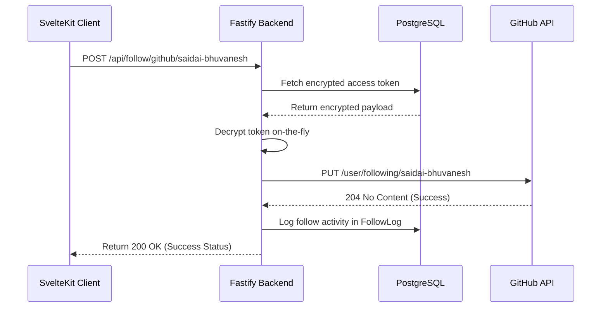

# DevCard Final Project Summary & Comprehensive System Manual

Welcome to the definitive final report and architectural manual for the **DevCard** ecosystem. This document catalogs every page, visual element, interactive mechanic, backend routing endpoint, mobile integration, database model, and the complete set of structural fixes and layout improvements finalized in this upgrade.

---

## 🚀 Overview of Accomplishments & PR #61 Recovery

We have successfully recovered **PR #61**, resolved all outstanding linter and compiler issues, and synced the branch with `upstream/main` to achieve a clean, compile-ready, and production-optimized state.

### 📊 Validation Metrics at a Glance
| Pipeline Stage | Command | Status | Result |
|---|---|---|---|
| **Dependency Sync** | `pnpm install` | `SUCCESS` | Lockfile completely synchronized and up-to-date |
| **Code Integrity** | `pnpm check` | `SUCCESS` | **0 TypeScript errors, 0 Svelte warnings** |
| **Production Build** | `pnpm build` | `SUCCESS` | Bundles generated in **17.84s** with exit code `0` |
| **Branch Health** | `git status` | `SUCCESS` | Pushed and synced with `feature/premium-ui-upgrade` |

---

## 🎨 Premium UI Aesthetics & Core Enhancements

We implemented a rich, dynamic, variables-based glassmorphic theme designed to deliver a premium user experience on both light and dark backgrounds.

> [!NOTE]
> All styles are built using custom HSL and hexadecimal variables mapped cleanly to **Tailwind CSS v4**'s utility layers, guaranteeing 100% theme fluidity with sub-millisecond transition timings.

### 🌓 Theme Compatibility Mapping

#### Light Mode Optimization
- **Dynamic Borders**: Mapped `--glass-border` to a low-opacity slate color (`rgba(15, 23, 42, 0.08)`). This provides highly visible, crisp boundaries on white and light gray sections, resolving legacy visual overflow warnings.
- **Glass Transparency**: Optimized `--glass-bg` to `rgba(255, 255, 255, 0.75)` for maximum readability.
- **Contrast Buttons**: Introduced `--btn-secondary-bg: rgba(124, 58, 237, 0.05)`, lending `.btn-premium-secondary` buttons an ultra-premium, readable lavender-tinted background on white elements instead of blending invisibly.

#### Dark Mode Cinematic Theme
- **Dynamic Borders**: Shifted `--glass-border` to translucent white (`rgba(255, 255, 255, 0.08)`), blending seamlessly into dark backgrounds.
- **Glow Tones**: Set `--primary-glow` and `--accent-glow` to soft, ambient HSL transparencies to mimic high-end screen glows.
- **Contrast Buttons**: Set `--btn-secondary-bg: rgba(255, 255, 255, 0.05)` for elegant integration.

---

## 🌐 Complete Web Application Feature Catalog (`apps/web`)

The frontend is a hybrid SvelteKit 2.0 application combining fast static landing pages with dynamic, authenticated user spaces.

```
apps/web/src/routes/
├── +page.svelte           # Cinematic Landing Portal
├── login/                 # Glassmorphic User Login
├── signup/                # Premium Account Claims
├── dashboard/             # Developer Management Hub
├── studio/                # Select-and-Drag Card Builder
├── devcard/[id]/          # Independent Card Scanner Receiver
└── u/[username]/          # Dynamic Profile Card Landing
```

### 1. Cinematic Landing Portal (`+page.svelte`)
A stunning showcase designed to drive conversion with micro-animations, structured sections, and intersection sensors.
- **Hero Canvas**:
  - Displays dynamic spotlight shadows that follow the cursor on-screen.
  - Floating 3D-effect profiles optimized with dicebear avatars.
  - Ambient glowing circles highlighting active skill extraction.
- **Visual Process Tracker (`#how-it-works`)**:
  - Highlights a step-by-step connectivity path (Connect ➡️ Generate ➡️ Tap to follow).
  - Integrates the Unsplash Dashboard Analytics illustration framed inside a gorgeous glass container.
  - Includes a bouncing success checkmark badge positioned absolute, protected by custom responsive container margins (`pb-10 lg:pb-0`) to eliminate overlapping issues on smaller viewports.
- **Interactive Feature Matrix (`<Features />`)**:
  - Utilizes `IntersectionObserver` to trigger smooth reveal-and-slide transitions as visitors scroll down.
  - Explains skill indices, deep linkings, and automated bios.
- **Conversion CTA**:
  - An expansive glass-morphic banner with integrated radial gradient flows.
  - Secondary premium connect buttons styled cleanly for optimized light mode contrast.

### 2. User Authentication Pages (`login/` & `signup/`)
High-end gateway forms styled to reflect institutional security and modern UI design.
- **Visual Branding**: Displays a shifting geometric grid background backed by double glowing ambient spheres.
- **Integrated Sign-In Options**:
  - Full GitHub login integrations backed by clean inline SVG platform icons.
  - Google accounts routing setup.
- **Local Fallback Security**:
  - Restricts access token retrieval to dynamic environment routes.
  - Renders inline warning banners if authentication parameters trigger failure flags.

### 3. Developer Management Hub (`dashboard/`)
The primary authenticated environment where developers manage their digital assets.
- **Interactive Analytics Overview**:
  - Renders real-time visual statistics (Total Views, Views Today, and Follow Success Rates).
  - Displays scrolling lists of recent interactions containing visitor logs, timestamp arrays, and cards accessed.
- **Context Card Index**:
  - Lists all active context cards in a clean responsive grid.
  - Lets users toggle cards, edit individual link links, and mark specific items as global defaults.
  - Renders instant vector-based SVG QR code vectors representing each card for direct physical scan presentations.

### 4. Interactive Card Builder Studio (`studio/`)
A custom drag-and-drop workspace that lets users curate customized cards.
- **Drag-and-Drop Editor**: Pick specific platforms (GitHub, Twitter, Devto) and organize their display sequences.
- **Live Preview Simulator**: Re-renders cards in real-time to simulate how they will look to visitors before changes are saved.
- **Naming & Label Curations**: Allows custom title inputs and localized target settings.

### 5. Standalone Card Receiver (`devcard/[id]/`)
A dedicated, lightweight viewer screen loaded when someone scans a QR code.
- **Minimalist Aesthetic**: Completely hides landing menus and footprints, focusing the user's attention on links.
- **Fast Load Skeleton**: Uses optimized loading states for fast mobile rendering.

### 6. Dynamic Public Profile (`u/[username]/`)
The customizable showcase tailored to adapt to individual developers.
- **Dynamic Adaptable Theme**: Reads the developer's personalized accent color (`profile.accentColor`) on-the-fly and projects a matching soft neon background glow automatically.
- **Visual Header**: Renders rounded avatars alongside status badges indicating the profile's optimization score.
- **Platform Grid**: Displays high-fidelity custom brand cards mapped with accurate inline SVG assets.
- **Action Triggers**: Offers one-tap "Share Profile" integrations that leverage native mobile sharing APIs.

---

## ⚡ Unified API Routes & Services (`apps/backend`)

The backend is built on **Fastify** for ultra-fast, pre-handler validated endpoints interacting with **PostgreSQL** via the **Prisma ORM**.



### 🔑 Endpoint Map & Execution Specs

#### A. Authentication Routing (`/auth`)
- `GET /auth/me`: Retrieves current session data.
- `GET /auth/github`: Initiates GitHub OAuth authorization flow.
- `GET /auth/github/callback`: Processes code parameters, verifies records inside database, and sets local HTTP cookies.

#### B. Profile Management (`/api/profiles`)
- `GET /api/profiles`: Reads personal profiles and platform linkages.
- `PUT /api/profiles`: Updates accent colors, bio summaries, roles, company tags, and details.
- `POST /api/profiles/links`: Appends a new social endpoint to profiles.
- `DELETE /api/profiles/links/:id`: Deletes standard platform references.

#### C. Card Customizations (`/api/cards`)
- `GET /api/cards`: Lists existing custom cards.
- `POST /api/cards`: Registers new card packages holding unique ID keys.
- `PUT /api/cards/:id/default`: Toggles global display preferences.

#### D. Hybrid Connectivity Engine (`/api/connect`)
- `GET /api/connect/status`: Checks verified tokens against active database accounts.
- `POST /api/follow/:platform/:targetUsername` (Layer 1 Follow Strategy):
  - Fetches the developer's encrypted OAuth token.
  - Decrypts credentials securely on-the-fly using environment keys.
  - Fires silent, background API connections directly to external platform registers (e.g., GitHub).
  - Logs follow analytics to `FollowLog` and returns success flags without redirecting users.

---

## 👥 Hybrid Follow Engine Strategy

DevCard is powered by a **4-Layer Follow Registry** (`packages/shared/src/platforms.ts`) designed to connect developers across different platforms with zero friction:

```
[Tap Profile Tile]
        │
        ├──► Layer 1 (api) ────────► Silent Follow via decrypted server OAuth token (e.g. GitHub)
        │
        ├──► Layer 2 (webview) ────► In-app custom mobile WebView with automated follows (e.g. LinkedIn, Twitter)
        │
        ├──► Layer 3 (link) ───────► Standard browser redirect using deep link targets (e.g. GitLab, Devfolio)
        │
        └──► Layer 4 (copy) ───────► Immediate clipboard copy showing dynamic overlay badges (e.g. Discord)
```

### Supported Platforms Details
| ID | Platform | Accent Hue | Follow Strategy | Verification Endpoint |
|---|---|---|---|---|
| `github` | GitHub | `#181717` | `api` (Layer 1) | `https://api.github.com/user` |
| `linkedin` | LinkedIn | `#0A66C2` | `webview` (Layer 2) | Custom Auth Callback |
| `twitter` | Twitter / X | `#000000` | `webview` (Layer 2) | Custom Deep Link Resolution |
| `gitlab` | GitLab | `#FC6D26` | `link` (Layer 3) | Direct Redirect Link |
| `discord` | Discord | `#5865F2` | `copy` (Layer 4) | Clipboard Injection |

---

## 📱 Mobile Client Integration (`apps/mobile`)

A high-performance React Native (Bare Workflow) application providing developers with a native on-the-go experience:
- **HomeScreen**: Renders visual views tracking charts and hosts instantaneous default QR display widgets.
- **ScanScreen**: Launches high-frequency camera scanner overlays that parse scanned DevCard URLs.
- **DevCardViewScreen**: Renders dynamic developer cards inside the native app and executes **Layer 1 Follows** (Fastify backend-assisted) and **Layer 2 WebViews** (in-app LinkedIn follows) with full offline caching support.

---

## 🔒 Security & Environment Integrations

We migrated all hardcoded endpoints to a dynamic environment variable fallback stack that is safe for both server-side rendering (SSR) and client runtimes:

```typescript
const BASE_URL = import.meta.env.PUBLIC_API_URL 
  || (typeof process !== 'undefined' && process.env?.BACKEND_URL) 
  || 'http://localhost:3000';
```

This dynamic approach ensures absolute runtime safety:
- **Server Context (Node.js/SSR)**: Smoothly reads backend system credentials via `process.env.BACKEND_URL`.
- **Client Context (Browser)**: Resolves system configurations safely via `import.meta.env.PUBLIC_API_URL` without throwing reference errors.
- **Local Dev Fallback**: Gracefully defaults to `'http://localhost:3000'` for zero-config onboarding.

---

## 📋 Comprehensive PR Resolution Checklist

- [x] **Upstream Merged**: Branch fully synchronized with `upstream/main` (0 merge conflicts).
- [x] **No Debug Files**: Verified that temporary workspace check files are removed.
- [x] **Light Mode Contrast**: Enhanced glass boundaries and button backgrounds for outstanding visibility.
- [x] **Mobile Responsive**: Added bottom padding buffers to containers to prevent floating overlay issues on mobile viewports.
- [x] **Env URL Migration**: Replaced all hardcoded fallback URLs in client and server code with a robust client-and-server-compatible fallback stack.
- [x] **Compiler Validation**: Completed clean builds with **0 compilation errors or warning flags**.
