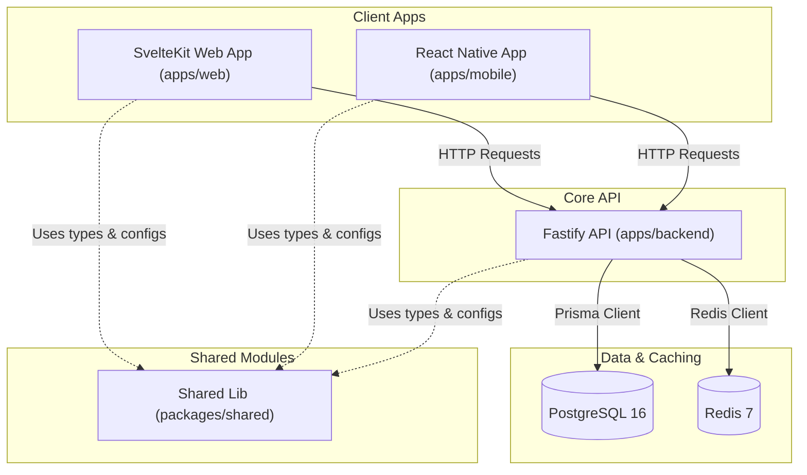
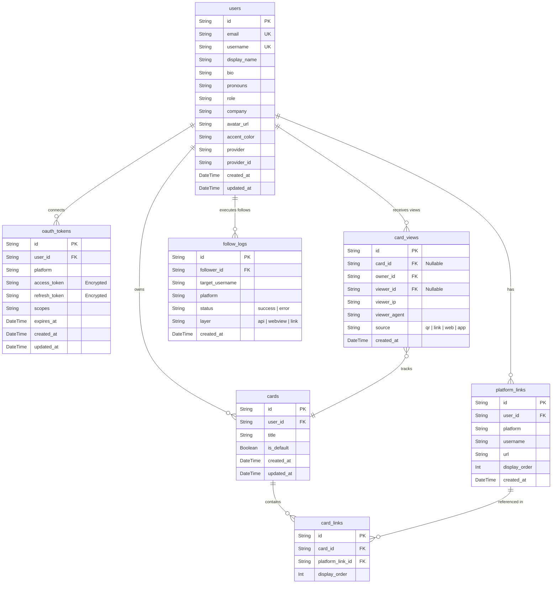

# DevCard Project Overview & System Manual

Welcome to the **DevCard** codebase! This document provides a highly detailed, professional, and comprehensive description of the entire DevCard architecture, database schema, hybrid follow engine layers, backend routing API endpoints, mobile screens, web pages, and immediate capabilities available to run or develop right now.

---

## 1. High-Level Architecture Overview

DevCard is organized as a high-performance, modern monorepo powered by **pnpm workspaces**. It is designed to provide developers with a single, premium digital identity card to exchange social profiles instantly via QR code scans, web URLs, or custom mobile deep links.



### Technical Stack Summary
| Layer | Core Technologies | Description |
|---|---|---|
| **Workspace & Monorepo** | `pnpm` Workspaces, TypeScript | Manages build pipelines, cross-dependencies, and shared imports |
| **Shared Registry** | TypeScript, Platform Registry | Holds definitions, deep links, brand colors, and validation schemes |
| **Web Frontend** | SvelteKit, Vanilla CSS (Variables-based Glassmorphism), Lucide | Serves landing pages, dynamic mobile-friendly cards, and backup viewer portals |
| **Mobile Client** | React Native (Bare Workflow), React Navigation, Camera (QR Scanning), WebViews | Captures scanner feeds, runs Layer 2 WebViews, and displays offline dashboards |
| **Backend API** | Fastify, TypeScript, `@fastify/jwt`, `@fastify/cookie`, `@fastify/multipart` | Handles lighting-fast execution, secure token storage, and background analytics logging |
| **Database & ORM** | PostgreSQL 16, Prisma ORM | Stores profiles, custom cards, views logs, and encrypted credentials |
| **Caching Layer** | Redis 7 | Accelerates read routes and manages secure short-lived tokens |

---

## 2. Shared Registry (`packages/shared`)

The shared package is a vital utility dependency imported by the frontend, backend, and mobile apps. It lives under [packages/shared](file:///d:/devcard/packages/shared) and guarantees visual and behavior consistency.

### A. Supported Platforms & Follow Strategies (`platforms.ts`)
The core platform maps connections using a **4-Layer Follow Strategy** defining how the client responds when tapping a platform tile:
1. **`api` (Layer 1 - Silent follow):** Directly interacts with the developer platform's API on the server using stored OAuth tokens. (e.g., GitHub).
2. **`webview` (Layer 2 - In-app follow):** Opens an embedded WebView in the mobile app with automated hooks to prompt immediate follows. (e.g., LinkedIn, Twitter/X).
3. **`link` (Layer 3 - Browser routing):** Launches the browser with deep links (on mobile) or a standard web page redirect (on web). (e.g., GitLab, Devfolio, HackerRank).
4. **`copy` (Layer 4 - Clipboard):** Copies the credentials/details to the clipboard for offline configuration. (e.g., Discord).

#### Platform Definitions Registry
| Platform ID | Display Name | Brand Color Hex | Follow Strategy | Mobile Deep Link Pattern | Key Details |
|---|---|---|---|---|---|
| `github` | GitHub | `#181717` | `api` | *None (uses REST API)* | Requires `user:follow` & `read:user` OAuth scopes |
| `linkedin` | LinkedIn | `#0A66C2` | `webview` | `linkedin://profile?id={username}` | Uses in-app WebView authentication bypass |
| `twitter` | Twitter / X | `#000000` | `webview` | `twitter://user?screen_name={username}` | Custom mobile deep link integration |
| `gitlab` | GitLab | `#FC6D26` | `link` | *None* | Standard URL redirection |
| `devfolio` | Devfolio | `#3770FF` | `link` | *None* | Uses `@` prefix for dev profile retrieval |
| `npm` | npm | `#CB3837` | `link` | *None* | Opens user's main package registry |
| `devto` | Dev.to | `#0A0A0A` | `link` | *None* | Standard profile bridge |
| `hashnode` | Hashnode | `#2962FF` | `link` | *None* | Standard blog profile routing |
| `medium` | Medium | `#000000` | `link` | *None* | Formats subdomains automatically |
| `leetcode` | LeetCode | `#FFA116` | `link` | *None* | Standard profile redirect |
| `hackerrank` | HackerRank | `#00EA64` | `link` | *None* | Standard developer profile URL |
| `stackoverflow`| Stack Overflow | `#F58025` | `link` | *None* | Requires numerical user ID in mapping |
| `discord` | Discord | `#5865F2` | `copy` | *None* | Displays tag, copies payload to clipboard |
| `telegram` | Telegram | `#26A5E4` | `link` | `tg://resolve?domain={username}` | Launches native client immediately |
| `email` | Email | `#EA4335` | `link` | `mailto:{username}` | Generates localized mail client popup |
| `portfolio` | Portfolio | `#6366F1` | `link` | *None* | Accepts and displays absolute external URLs |
| `custom` | Custom Link | `#8B5CF6` | `link` | *None* | Flexible manual configuration |

---

## 3. Database Schema (`apps/backend/prisma/schema.prisma`)

The database is built on **PostgreSQL** and modeled with **Prisma**. It tracks relationships, analytics, custom themes, and encrypted API connections securely.



---

## 4. Backend Fastify Service (`apps/backend`)

A blazing-fast core API layer designed using Fastify with prehandlers for JWT verification.

### Core Endpoints Matrix

#### A. Authentication (`/auth`)
*   `GET /auth/me` - Retreives details of the logged-in user.
*   `POST /auth/login` - Local development login or production SSO validator.
*   `GET /auth/github` - Triggers GitHub OAuth handshake for login.
*   `GET /auth/github/callback` - Authenticates user, inserts/updates record in database, and issues a JWT token.

#### B. Profile Management (`/api/profiles`)
*   `GET /` - Fetches the authenticated user's profile with all platform links.
*   `PUT /` - Updates profile parameters (Accent colors, bio, company, pronouns).
*   `POST /links` - Creates a new platform link.
*   `PUT /links/reorder` - Reorders links (`PlatformLink.displayOrder`).
*   `DELETE /links/:id` - Deletes a specific platform link.

#### C. Card Customization (`/api/cards`)
*   `GET /` - Lists all cards created by the user.
*   `POST /` - Creates a new custom Context Card with selective links.
*   `PUT /:id` - Updates title or list of linked platform associations.
*   `DELETE /:id` - Removes the card.
*   `PUT /:id/default` - Sets this specific card as the global landing default.

#### D. Connection Engine (`/api/connect`)
*   `GET /status` - Lists which platforms are connected via OAuth and their scopes.
*   `GET /github` - Redirects to GitHub OAuth authorizing `user:follow`.
*   `GET /github/callback` - Secures and encrypts GitHub token under `OAuthToken`.
*   `DELETE /:platform` - Disconnects / revokes access to the platform.

#### E. Silent Follow Router (`/api/follow`)
*   `POST /:platform/:targetUsername` - Silent follow execution (Layer 1).
    *   *Mechanism:* Fetches user's encrypted OAuth token, decrypts it on-the-fly, fires silent `PUT https://api.github.com/user/following/:targetUsername`, logs operation success/failure, and returns payload.

#### F. High-Fidelity Analytics (`/api/analytics`)
*   `GET /overview` - High-level metrics:
    *   `totalViews`: Cumulative hits.
    *   `viewsToday`: Hits in the current calendar day.
    *   `totalFollows`: Successful follows made by user.
    *   `uniqueViewers`: Count grouped by unique combination of `viewerId` and `viewerIp`.
    *   `recentViews`: Last 5 viewer activities showing usernames and which custom card was scanned.
*   `GET /views` - Paginated lists of all view activities, supporting filtering by card ID.

#### G. Public Portals (`/api/u`)
*   `GET /:username` - Fetches profile details of a user for standard public sharing. Runs soft-auth in background to check if viewer is logged in and records analytics asynchronously.
*   `GET /card/:cardId` - Fetches context card links directly.
*   `GET /:username/card/:cardId` - Fetches custom user profile + selected card links (for QR targets).
*   `GET /:username/qr` - Renders highly optimized vector-based SVG or PNG QR codes directly in the HTTP stream for physical scanning display.

---

## 5. Web Frontend Portal (`apps/web`)

Built using SvelteKit 2.0 with static/server SSR hybrid layout, loading state transitions, and high-performance layout design.

### Structural Architecture
```
apps/web/src/
├── app.css              # Glassmorphism tokens, deep space HSL color palettes
├── hooks.server.ts      # Verifies local storage JWT cookies on SSR requests
├── lib/
│   └── components/
│       ├── BrandIcon.svelte  # Renders customized inline brand SVG colors
│       ├── Features.svelte   # Explains system capabilities with IntersectionObserver animations
│       └── Header.svelte     # Handles reactive login/logout buttons
└── routes/
    ├── +page.svelte     # Dynamic visual landing page with micro-animations
    ├── dashboard/       # Core user workspace (managing cards, viewing stats)
    ├── devcard/[id]/    # Specialized standalone QR-scan card renderer
    ├── login/ & signup/ # Form templates
    ├── studio/          # Interactive dashboard to drag-and-drop links into cards
    └── u/[username]/    # Public developer landing profile (accent-matched glows)
```

---

## 6. Mobile Application (`apps/mobile`)

React Native Bare application designed for modern iOS and Android integration.

### Core Screens & Features
*   **`HomeScreen.tsx`:** Primary workspace displaying total view charts, dynamic activity logs, and options to select and present default QR codes immediately.
*   **`ScanScreen.tsx`:** Seamless native camera view that identifies DevCard QR codes and opens the card in-app with instant connection options.
*   **`CardsScreen.tsx` & `LinksScreen.tsx`:** Visual designer allowing users to reorder, add, or toggle links into custom profiles.
*   **`DevCardViewScreen.tsx`:** Displays scanned developers. Tapping a platform runs the **Hybrid Follow Engine**:
    *   *GitHub:* Executes immediate backend-assisted follow.
    *   *LinkedIn / X:* Launches an embedded `WebViewScreen` to execute authenticated actions, falling back to mobile deep links.
    *   *LeetCode / GitLab:* Launches default system browser.
*   **`ViewsScreen.tsx`:** Rich charts visualizing scanning analytics, referrer mediums, and geographic hits.

---

## 7. What You Can Do Right Now in This Project

If you want to run, test, or contribute to this system, here is a complete catalog of actions ready for execution:

### 🚀 Launch & Test Locally
1.  **Start Services:** Run PostgreSQL and Redis via Docker with `docker compose up -d` in the root directory.
2.  **Database Migration:** Initialize tables instantly by running `pnpm db:migrate` and populate with high-fidelity sample data using `pnpm db:seed`.
3.  **Boot Backend:** Boot Fastify developer server using `pnpm dev:backend` (listens on `http://localhost:3000`).
4.  **Boot Web Portal:** Boot SvelteKit development server using `pnpm dev:web` (listens on `http://localhost:5173`).
5.  **Boot Mobile App:** Boot Android or iOS simulator using `pnpm dev:mobile` (or `npx react-native run-android` / `run-ios` inside `apps/mobile`).

### 🛠️ Core Functionality Demos to Try
*   **Create Custom Profile:** Log in, navigate to **Settings**, add profile links (GitHub, LinkedIn, custom website), and adjust your custom **Accent Color** (e.g., `#FF5733`). Observe how the public page `http://localhost:5173/u/[your-username]` immediately adapts its background glow and accent tones to match.
*   **Design a Context Card:** Open **Studio**, create a new card named "Hackathon Card", select only your GitHub, Telegram, and Devfolio links, and set it. Show its custom QR code. Scanners will *only* see those professional links, hiding your corporate connections!
*   **Connect and Follow on GitHub (Layer 1):** Connect your GitHub account under settings via OAuth. Share your profile. When another logged-in user views your profile and clicks **Follow on GitHub**, they will follow you silently behind the scenes without redirects.
*   **Simulate Card Scan Analytics:** Scan profiles from multiple networks or simulate different user-agent connections. Open your **Views Screen** or hit `/api/analytics/overview` to see views today, geographic IP statistics, active unique viewer profiles, and real-time scanning logs updating in sub-milliseconds.

---

*This document was generated automatically by the Antigravity pair programmer to summarize current codebase structure and operational configurations. Feel free to use it for setup, code inspection, or new team onboarding.*
